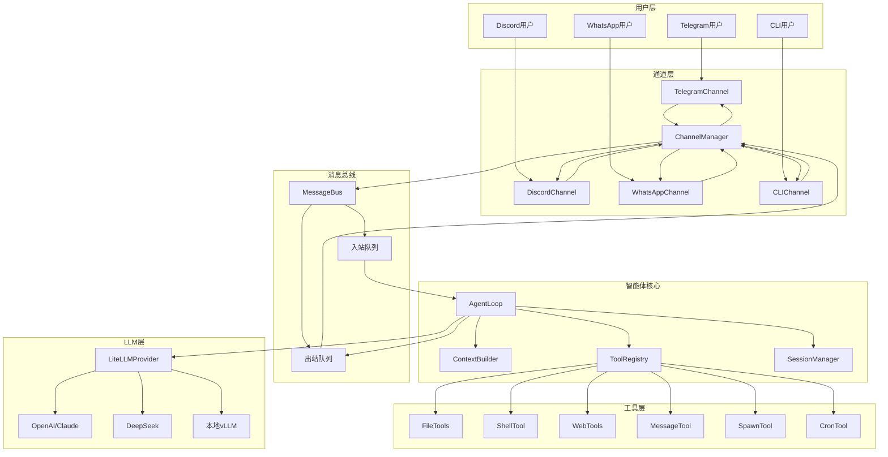
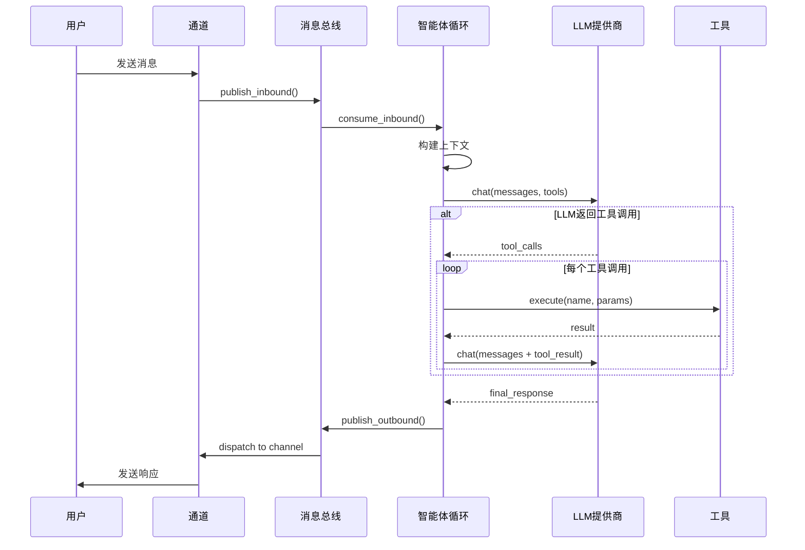
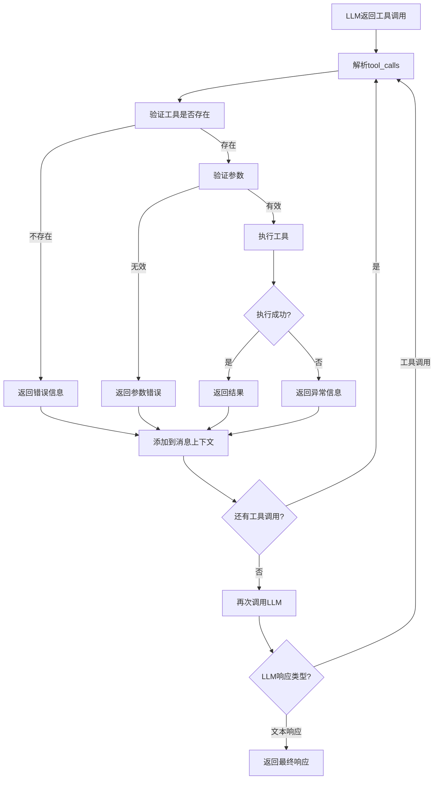
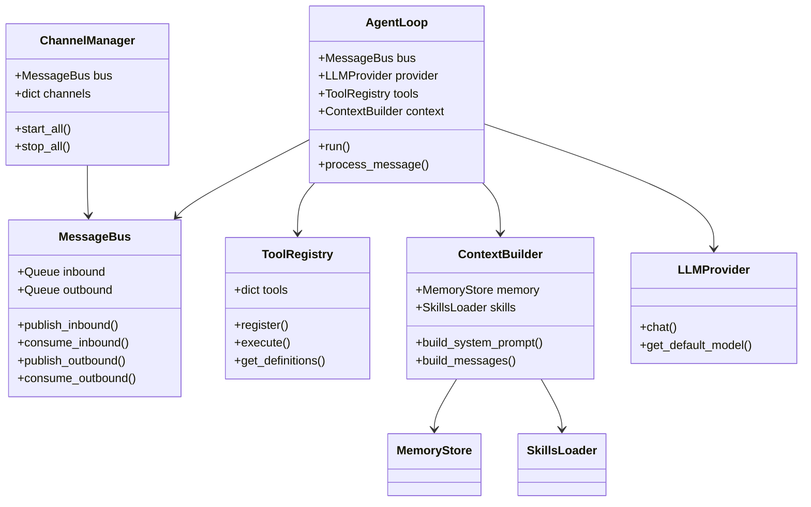

# nanobot 技术架构文档

## 1. 设计思路

### 1.1 核心设计理念

**极简主义架构**：nanobot 采用"少即是多"的设计哲学，用 ~4,000 行代码实现完整的 AI 助手功能，相比同类项目减少 99% 代码量。

**关键设计原则**：

1. **模块化解耦**：每个组件职责单一，通过消息总线实现松耦合通信
2. **异步优先**：基于 asyncio 实现非阻塞 I/O，支持高并发场景
3. **配置驱动**：通过 JSON 配置文件控制所有行为，无需修改代码
4. **渐进式加载**：按需加载技能和上下文，减少 token 消耗
5. **可扩展性**：插件式架构，易于添加新通道、工具和 LLM 提供商

### 1.2 架构分层

```
┌─────────────────────────────────────────────────────────┐
│                    用户交互层                              │
│  Telegram │ Discord │ WhatsApp │ Feishu │ CLI            │
└─────────────────────────────────────────────────────────┘
                          ↓
┌─────────────────────────────────────────────────────────┐
│                    通道管理层                              │
│  ChannelManager - 统一管理所有聊天通道                      │
└─────────────────────────────────────────────────────────┘
                          ↓
┌─────────────────────────────────────────────────────────┐
│                    消息总线层                              │
│  MessageBus - 异步消息队列（入站/出站）                     │
└─────────────────────────────────────────────────────────┘
                          ↓
┌─────────────────────────────────────────────────────────┐
│                    智能体核心层                            │
│  AgentLoop - LLM 调用 + 工具执行循环                       │
│  ContextBuilder - 上下文构建（提示词工程）                  │
│  ToolRegistry - 工具注册与执行                             │
└─────────────────────────────────────────────────────────┘
                          ↓
┌─────────────────────────────────────────────────────────┐
│                    能力扩展层                              │
│  Tools │ Skills │ Memory │ Subagents │ Cron              │
└─────────────────────────────────────────────────────────┘
                          ↓
┌─────────────────────────────────────────────────────────┐
│                    基础设施层                              │
│  LLM Providers │ Session Manager │ Config Loader         │
└─────────────────────────────────────────────────────────┘
```

### 1.3 核心设计模式

1. **生产者-消费者模式**：通道生产消息 → 智能体消费处理
2. **发布-订阅模式**：智能体发布响应 → 通道订阅接收
3. **策略模式**：多 LLM 提供商统一接口
4. **注册表模式**：工具动态注册与查找
5. **建造者模式**：上下文分步构建

## 2. 项目规划图

### 2.1 系统架构图



### 2.2 消息流程图



### 2.3 工具执行流程图



### 2.4 组件关系图



## 3. 核心模块最简示例

### 3.1 消息总线（MessageBus）

**作用**：解耦通道与智能体，实现异步消息传递

**最简示例**：

```python
from nanobot.bus.queue import MessageBus
from nanobot.bus.events import InboundMessage, OutboundMessage
import asyncio

async def minimal_bus_example():
    # 创建消息总线
    bus = MessageBus()
    
    # 发布入站消息（模拟用户输入）
    msg = InboundMessage(
        channel="cli",
        sender_id="user1",
        chat_id="chat1",
        content="Hello, nanobot!"
    )
    await bus.publish_inbound(msg)
    
    # 消费消息（智能体侧）
    received = await bus.consume_inbound()
    print(f"收到: {received.content}")
    
    # 发布响应（智能体侧）
    response = OutboundMessage(
        channel="cli",
        chat_id="chat1",
        content="Hello! How can I help?"
    )
    await bus.publish_outbound(response)
    
    # 消费响应（通道侧）
    out_msg = await bus.consume_outbound()
    print(f"响应: {out_msg.content}")

asyncio.run(minimal_bus_example())
```

**核心价值**：
- 通道和智能体完全解耦，可独立开发和测试
- 异步队列提供天然的背压和流控
- 支持多通道并发，单个通道故障不影响其他通道

### 3.2 智能体循环（AgentLoop）

**作用**：协调 LLM 调用和工具执行的核心引擎

**最简示例**：

```python
from nanobot.agent.loop import AgentLoop
from nanobot.bus.queue import MessageBus
from nanobot.providers.litellm_provider import LiteLLMProvider
from pathlib import Path

async def minimal_agent_example():
    # 初始化组件
    bus = MessageBus()
    provider = LiteLLMProvider(api_key="your-key")
    workspace = Path.home() / ".nanobot" / "workspace"
    
    # 创建智能体
    agent = AgentLoop(
        bus=bus,
        provider=provider,
        workspace=workspace,
        model="gpt-4o-mini"
    )
    
    # 直接处理消息（绕过总线）
    response = await agent.process_direct(
        content="What is 2+2?",
        session_key="test:session"
    )
    print(f"智能体响应: {response}")

asyncio.run(minimal_agent_example())
```

**核心价值**：
- 自动管理 LLM 多轮对话
- 工具调用循环（最多 20 次迭代）
- 会话持久化和上下文管理

### 3.3 工具系统（ToolRegistry）

**作用**：动态注册和执行智能体工具

**最简示例**：

```python
from nanobot.agent.tools.registry import ToolRegistry
from nanobot.agent.tools.base import Tool

# 定义自定义工具
class CalculatorTool(Tool):
    name = "calculator"
    description = "执行简单数学计算"
    
    parameters = {
        "type": "object",
        "properties": {
            "expression": {
                "type": "string",
                "description": "数学表达式，如 '2+2'"
            }
        },
        "required": ["expression"]
    }
    
    async def execute(self, expression: str) -> str:
        try:
            result = eval(expression)
            return f"结果: {result}"
        except Exception as e:
            return f"错误: {e}"

async def minimal_tool_example():
    # 创建注册表
    registry = ToolRegistry()
    
    # 注册工具
    registry.register(CalculatorTool())
    
    # 获取工具定义（供 LLM 使用）
    definitions = registry.get_definitions()
    print(f"工具定义: {definitions}")
    
    # 执行工具
    result = await registry.execute(
        name="calculator",
        params={"expression": "10 * 5"}
    )
    print(f"执行结果: {result}")

asyncio.run(minimal_tool_example())
```

**核心价值**：
- 统一的工具接口（OpenAI 格式）
- 自动参数验证
- 错误隔离和处理

### 3.4 通道管理（ChannelManager）

**作用**：统一管理多个聊天平台集成

**最简示例**：

```python
from nanobot.channels.manager import ChannelManager
from nanobot.bus.queue import MessageBus
from nanobot.config.loader import load_config

async def minimal_channel_example():
    # 加载配置
    config = load_config()
    
    # 创建消息总线
    bus = MessageBus()
    
    # 创建通道管理器
    manager = ChannelManager(config, bus)
    
    # 查看启用的通道
    print(f"启用通道: {manager.enabled_channels}")
    
    # 获取状态
    status = manager.get_status()
    for name, info in status.items():
        print(f"{name}: {info}")
    
    # 启动所有通道（阻塞运行）
    # await manager.start_all()

# 配置示例 (~/.nanobot/config.json)
"""
{
  "channels": {
    "telegram": {
      "enabled": true,
      "token": "YOUR_BOT_TOKEN",
      "allowFrom": ["user_id"]
    }
  }
}
"""
```

**核心价值**：
- 配置驱动的通道启用
- 统一的生命周期管理
- 错误隔离（单个通道失败不影响其他）

### 3.5 上下文构建（ContextBuilder）

**作用**：组装系统提示、记忆、技能和会话历史

**最简示例**：

```python
from nanobot.agent.context import ContextBuilder
from pathlib import Path

def minimal_context_example():
    # 创建上下文构建器
    workspace = Path.home() / ".nanobot" / "workspace"
    builder = ContextBuilder(workspace)
    
    # 构建系统提示
    system_prompt = builder.build_system_prompt()
    print(f"系统提示长度: {len(system_prompt)} 字符")
    print(f"预览:\n{system_prompt[:500]}...")
    
    # 构建完整消息列表
    history = [
        {"role": "user", "content": "你好"},
        {"role": "assistant", "content": "你好！"}
    ]
    
    messages = builder.build_messages(
        history=history,
        current_message="今天天气怎么样？",
        channel="telegram",
        chat_id="user123"
    )
    
    print(f"\n消息列表包含 {len(messages)} 条消息")
    for msg in messages:
        role = msg["role"]
        content = str(msg["content"])[:50]
        print(f"  {role}: {content}...")

minimal_context_example()
```

**核心价值**：
- 渐进式技能加载（减少 token）
- 自动整合记忆和引导文件
- 支持多模态输入（图片 base64 编码）

### 3.6 完整工作流示例

**端到端消息处理**：

```python
import asyncio
from pathlib import Path
from nanobot.bus.queue import MessageBus
from nanobot.bus.events import InboundMessage
from nanobot.agent.loop import AgentLoop
from nanobot.providers.litellm_provider import LiteLLMProvider
from nanobot.channels.manager import ChannelManager
from nanobot.config.loader import load_config

async def complete_workflow():
    # 1. 加载配置
    config = load_config()
    workspace = config.workspace_path
    
    # 2. 创建消息总线
    bus = MessageBus()
    
    # 3. 创建 LLM 提供商
    provider = LiteLLMProvider(
        api_key=config.get_api_key(),
        api_base=config.get_api_base()
    )
    
    # 4. 创建智能体
    agent = AgentLoop(
        bus=bus,
        provider=provider,
        workspace=workspace,
        model=config.agents.defaults.model,
        max_iterations=config.agents.defaults.max_tool_iterations
    )
    
    # 5. 创建通道管理器
    channels = ChannelManager(config, bus)
    
    # 6. 启动组件（并发运行）
    await asyncio.gather(
        agent.run(),           # 智能体循环
        channels.start_all()   # 所有通道
    )

# 运行完整系统
if __name__ == "__main__":
    asyncio.run(complete_workflow())
```

## 4. 关键技术决策

### 4.1 为什么选择 asyncio？

- **高并发**：单线程处理多个通道和会话
- **非阻塞 I/O**：网络请求不阻塞其他操作
- **资源高效**：相比多线程/多进程更轻量

### 4.2 为什么使用消息总线？

- **解耦**：通道和智能体独立开发
- **可测试**：每个组件可单独测试
- **可扩展**：添加新通道无需修改核心代码

### 4.3 为什么采用工具注册表？

- **动态扩展**：运行时添加/移除工具
- **统一接口**：所有工具遵循相同规范
- **安全控制**：集中管理工具权限

### 4.4 为什么支持多 LLM 提供商？

- **灵活性**：根据任务选择最佳模型
- **成本优化**：使用更便宜的模型
- **避免锁定**：不依赖单一供应商

## 5. 性能优化策略

### 5.1 上下文优化

- **渐进式技能加载**：只在系统提示中包含技能摘要，按需读取完整内容
- **会话历史截断**：保留最近 N 条消息，避免上下文过长
- **缓存系统提示**：无变化时重用已构建的提示

### 5.2 并发优化

- **异步工具执行**：I/O 密集型工具并发执行
- **连接池**：复用 HTTP 连接
- **批量处理**：合并多个小请求

### 5.3 资源优化

- **按需加载**：延迟导入可选依赖
- **内存管理**：定期清理旧会话
- **日志轮转**：防止日志文件过大

## 6. 安全考虑

### 6.1 沙箱限制

```python
# 配置示例
{
  "tools": {
    "restrictToWorkspace": true  # 限制文件和命令执行到工作空间
  }
}
```

### 6.2 访问控制

```python
# 通道白名单
{
  "channels": {
    "telegram": {
      "allowFrom": ["user_id_1", "user_id_2"]  # 只允许特定用户
    }
  }
}
```

### 6.3 输入验证

- 工具参数自动验证（Pydantic）
- 路径遍历检测
- 命令注入防护

## 7. 扩展指南

### 7.1 添加新工具

```python
from nanobot.agent.tools.base import Tool

class MyTool(Tool):
    name = "my_tool"
    description = "工具描述"
    parameters = {...}  # JSON Schema
    
    async def execute(self, **kwargs) -> str:
        # 实现逻辑
        return "结果"

# 注册
registry.register(MyTool())
```

### 7.2 添加新通道

```python
from nanobot.channels.base import BaseChannel

class MyChannel(BaseChannel):
    async def start(self):
        # 启动逻辑
        pass
    
    async def stop(self):
        # 停止逻辑
        pass
    
    async def send(self, msg: OutboundMessage):
        # 发送消息
        pass
```

### 7.3 添加新 LLM 提供商

```python
from nanobot.providers.base import LLMProvider

class MyProvider(LLMProvider):
    async def chat(self, messages, tools, model):
        # 调用 API
        return LLMResponse(...)
```

## 8. 总结

nanobot 通过以下设计实现了极简而强大的架构：

1. **消息总线**：解耦通道与智能体
2. **异步优先**：高并发低资源消耗
3. **工具系统**：可扩展的能力框架
4. **配置驱动**：灵活的行为控制
5. **渐进式加载**：优化 token 使用

这种架构使得 nanobot 易于理解、修改和扩展，非常适合研究和学习 AI 助手的实现原理。
